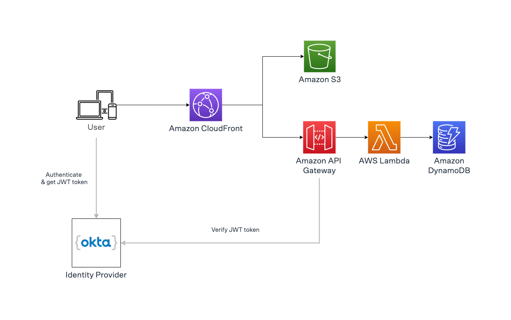

# serverless-voting-app

This is a demo voting app built with serverless services.

### Technologies

- AWS services: Amazon CloudFront, Amazon API Gateway, AWS Lambda, Amazon DynamoDB, Amazon S3.
- Okta (Identity Provider)
- Terraform
- AWS Lambda Powertools for TypeScript
- Bash
- K6

### Local Requirements:

You'll need to have Terraform & the AWS CLI installed locally, and an OKTA account.

* Terraform CLI (for example via tfenv)
* AWS CLI
* OKTA env credentials available in your terminal:
    * export OKTA_ORG_NAME=dev-1234567
    * export OKTA_BASE_URL=okta.com
    * export OKTA_API_TOKEN=12345678979654645646556
* (MacOS Only) `gdate` (GNU version of `date`).
    * Install with `brew install coreutil`
    * Run `gdate` to test that it's installed properly


If needed, read here [how to create an Okta API Token](https://bit.ly/get-okta-api-token).

Run:

1) Deploy the Terraform state hosted on an S3 bucket with a DynamoDB table for state lock in your AWS account:
```shell
export AWS_HOSTED_ZONE_NAME='your-hosted-zone-name.com'
chmod +x ./scripts/deploy-state.sh
./scripts/deploy-state.sh apply
```

2) Deploy the app (including OKTA):
```shell
chmod +x ./scripts/deploy.sh
./scripts/deploy.sh apply
```

### Architecture




### Deploying on existing account

The deployment script will create an ignored config file in `scripts/config/<ACCOUNT_ID>/backend.sh`. This file will reused for future deployments.

If the account has already had this app deployed but you don't have this file. You will get this error:

```sh
ERROR! File /path/to/your/code/serverless-voting-app/scripts/config/<ACCOUNT_ID>/backend.sh not found, please create the file in this repository with the following content:

#!/bin/bash
export TF_VAR_backend_region=[the AWS region where your dynamodb table and s3 bucket are located]
export TF_VAR_backend_bucket=[the name of the s3 bucket]
export TF_VAR_backend_table=[the name of the dynamodb table]
```

In that case, you have to create the file manually.